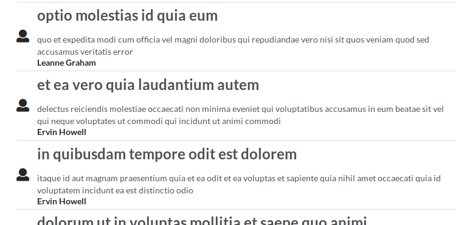

# Blog

This repository contains a React + Redux project that was completed as part of the Udemy course "Modern React with Redux 2019". 

The app fetches/displays data from the JSONPlaceholder API in a blog post-list format.

---

## Usage

Run

### `npm install`

to ensure that node modules are installed.

Once node modules are installed run

### `npm start`

Open [http://localhost:3000](http://localhost:3000) to view it in the browser.
